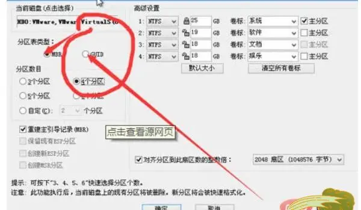
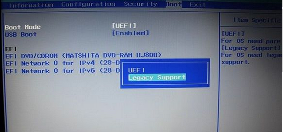

# [20231010]关于电脑安装多系统
## 1 基础知识
### 1.1 分区表

[上一节](./[20231010]文件系统.md)学习了文件系统的相关基本知识,其实就是每个分区的文件系统格式。像适用于windows的NTFS,用于Mac系统的Hfs+,还有用于通用格式的exfat等等。这些我们只需要使用磁盘工具简单的格式化成相应的分区就可以了。它的作用就像是一个盛水的容器。

但如果是在一个大容量硬盘里分了2个区，或者是在硬盘里安装了操作系统，那么就来到了这一节的话题。分区表。

分区表顾名思义，就是记录着硬盘里所有分区信息的文件，它的作用就是告知启动系统，需要加载硬盘的哪块部分。到哪里去找文件。分区表的作用，就像是一个指引你要去拿正确盛水容器的人。

其实，我们在安装系统的时候，经常会手动选择分区格式，其中就有guid和mbr两种，那么guid和mbr格式有什么区别呢，其实[他们主要就是启动方式和支持分区的区别](https://www.somode.com/winnews/19696.html)。

>可以点击上方软连接，查看区别

- **MBR格式**：MBR（Master Boot Record）分区表是传统的分区表格式，用于BIOS启动的硬盘。MBR分区表支持最多四个主分区，或者三个主分区和一个扩展分区，每个扩展分区可以包含多个逻辑分区。

  MBR的意思是“主引导记录”，是传统分区类型，只支持一个硬盘上最多4个主分区，最大的缺点是不支持2TB以上硬盘容量，而GUID就是新兴的GPT方式，支持的主分区数量没有限制。MBR支持win7版本系统以下的32位和64位，而GUID支持win7版本以上的64位系统。对于MBR需要了解的是，MBR是一个特殊的启动扇区，主要存在于磁盘驱动器开始部分，而且这个扇区包含了已安装的操作系统系统信息，并用一小段代码来启动系统。如果MBR的信息损坏或误删就不能正常启动Windows，这时候就需要找一个引导修复即可。

- **GUID格式**：GPT（GUID Partition Table）分区表：GPT是一种现代的分区表格式，用于UEFI启动的硬盘和较新的计算机系统。它支持更多的分区，具有更大的分区容量，以及更强的数据完整性和安全性。
  
  GUID（全称：Globally Unique Identifier），是一种由算法生成的二进制长度为128位的数字标识符。GUID主要用于在拥有多个节点、多台计算机的网络或系统中。在理想情况下，任何计算机和计算机集群都不会生成两个相同的GUID。GUID 的总数达到了2^128个，所以随机生成两个相同GUID的可能性非常小，但并不为0。所以，用于生成GUID的算法通常都加入了非随机的参数（如时间），以保证这种重复的情况不会发生。GUID一词有时也专指微软对UUID标准的实现。另外，还有磁盘分区表方案的含义，全局唯一标识分区表是一个实体硬盘的分区表的结构布局的标准。

  

### 1.2 启动模式
>在有了文件系统和分区表的基础知识后，就可以讲启动模式的概念了。
>
>在Legacy启动模式中，硬盘分区格式应该为MBR格式
>
>在UEFI启动模式中，硬盘分区格式应该为GUID（GPT）格式

两种启动模式：
其中BIOS设置中，有两种让他启动进入系统的方法，分别是为UEFI和Legacey。 如下图：

华硕主板里面的CSM支持，CSM支持的含义就是（兼容legacy+MBR启动模式）

其中（Legacy）BIOS是传统式的，而UEFI（Unified Extensible Firmware Interface）是后来发展出的可扩展固件接口，与legacy BIOS 相比，UEFI最大的几个区别在于：
- 1.编码99%都是由C语言完成；
- 2.一改之前的中断、硬件端口操作的方法，而采用了Driver/protocol的新方式；
- 3.将不支持X86实模式，而直接采用Flat mode（也就是不能用DOS了，现在有些 EFI 或 UEFI 能用是因为做了兼容，但实际上这部分不属于UEFI的定义了）；
- 4.输出也不再是单纯的二进制code，改为Removable Binary Drivers；
- 5.OS启动不再是调用Int19，而是直接利用protocol/device Path；
- 6.对于第三方的开发，前者基本上做不到，除非参与BIOS的设计，但是还要受到ROM的大小限制，而后者就便利多了。
- 7.弥补BIOS对新硬件的支持不足的问题。

**从开机流程看他们的不同：**
大家都知道Win8系统相对于Win7系统在开机速度上有相当大的提升，这是因为Win8系统为了提升系统性能和对硬件的优化，加入了诸如开机引导及应用预缓存等技术。而其中的UEFI BIOS引导，则能使平台开机更智能，开机速度更快。 让我们来看一下他们的开机到进入系统的区别：

这个是传统的Legacy运行流程：

这个是UEFI运行流程：

对比采用传统BIOS引导启动方式，UEFI BIOS减少了BIOS自检的步骤，节省了大量的时间，从而加快平台的启动。UEFI只支持64位系统且磁盘分区必须为GPT模式。

## 参考

[1.guid和mbr格式有什么区别](https://baijiahao.baidu.com/s?id=1741369293945103912)

[2.硬盘上的分区表是什么？分区和分区表一样嘛？](https://baijiahao.baidu.com/s?id=1748833557637845905&wfr=spider&for=pc)

[3.UEFI与 Legacy BIOS两种启动模式详解](https://blog.csdn.net/weixin_44657888/article/details/130482647)