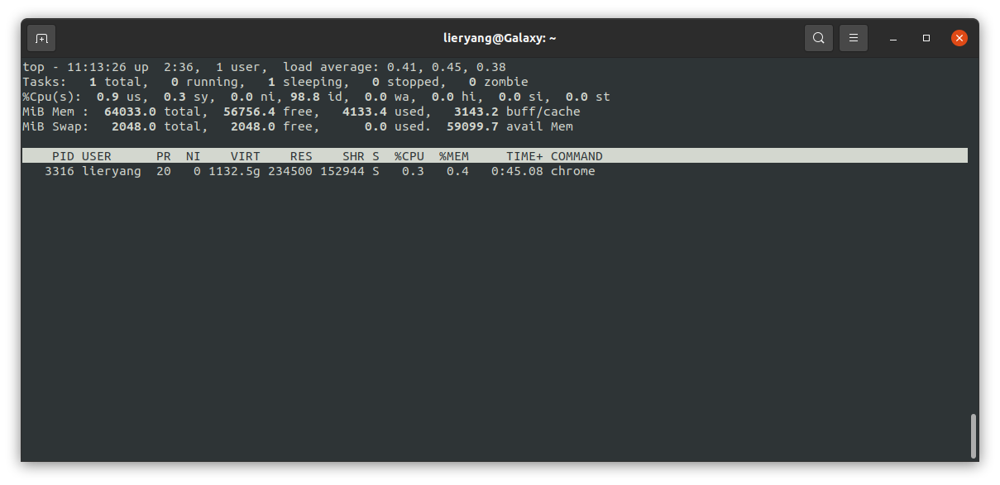

# [20231107]grep、ps、top命令

## 1 grep 命令

grep 命令是一个强大的文本搜索工具，它使用正则表达式来搜索文件，并输出匹配的行。它的名字来源于全局正则表达式打印（global regular expression print）的缩写。在 UNIX 和类 UNIX 系统中，grep 被广泛用于各种场景，从简单的文件搜索到管道命令中复杂的数据分析。

### 1.1 基本语法

```sh
grep [选项] [模式] [文件...]
```

- [选项]：grep 的行为可以通过选项进行控制，例如 -i（忽略大小写），-v（反转匹配），-r（递归搜索）等。

- [模式]：这是你想要搜索的文本模式，可以是字符串或正则表达式。

- [文件...]：这是你想要搜索的一个或多个文件名。如果没有指定文件，grep 通常会读取标准输入。

### 1.2 常用选项

- -i：忽略大小写

- -v：显示不包含匹配文本的行

- -c：计算匹配的行数

- -n：显示匹配的行号

- -r 或 -R：递归地搜索所有文件

- -l：只打印包含匹配项的文件名

- -e：指定多个搜索模式

- --color：将匹配的文本高亮显示

- -o：仅显示匹配部分

- -E：使用扩展正则表达式

### 1.3 示例

```sh
# 搜索文件 file.txt 中包含 "pattern" 的所有行
grep "pattern" file.txt

# 忽略大小写搜索 "pattern"
grep -i "pattern" file.txt

# 递归搜索当前目录及子目录中所有包含 "pattern" 的文件
grep -r "pattern" .

# 只显示文件名，不显示匹配的内容
grep -rl "pattern" .

# 计数有多少行包含 "pattern"
grep -c "pattern" file.txt

# 使用正则表达式匹配单词 "start" 开头的行
grep "^start" file.txt

# 使用扩展正则表达式搜索三个字符长的单词
grep -E "\b\w{3}\b" file.txt

# 使用管道命令结合 grep 搜索特定进程
ps aux | grep "httpd"

# 在多个文件中搜索，同时显示行号
grep -n "pattern" file1.txt file2.txt

```

## 2 ps 命令

ps 命令是<span style="background-color: pink">“Process Status”</span>的缩写，它是一个在Unix、Linux以及类Unix操作系统中用来显示当前系统中运行的进程的状态的工具。这个命令非常强大，它可以与各种选项和参数一起使用，以提供不同级别的详细信息。

ps 截取一瞬间进程信息，但不会动态显示和更新进程信息，如果需要重复更新进程信息请使用 `top` 命令。

### 2.1 ps 命令选项

#### ps aux

- a：显示关于其他用户的进程。

- u：以用户友好的格式显示进程信息，提供更多关于进程的详细信息，如用户名称、CPU 使用率、内存使用率等。

- x：显示没有控制终端的进程。这通常包括了大多数系统守护进程（daemon）和后台进程。


组合使用 `ps aux`` 参数，可以让你查看系统中所有进程的一个全面快照，包括其他用户的进程和没有终端的后台进程。这是一个非常常用的选项组合，因为它提供了关于系统当前进程状态的广泛视图。

| 名称 | 含义 |
|----------|----------|
| USER | 进程拥有者的用户名 |
| PID | 进程的ID |
| %CPU | 自进程启动以来，它占用的CPU使用百分比 |
| %MEM | 进程占用的物理内存的百分比 |
| VSZ | 虚拟内存大小（Virtual Memory Size），以千字节Kb为单位 |
| RSS | 实际内存大小（Resident Set Size），以千字节为单位。这是进程在物理内存中占用的空间大小，不包括交换空间。 |
| TTY | 与进程关联的终端（如果有的话）。如果进程没有终端，则会显示为 ?。 |
| STAT | 进程状态。常见状态码有： S - 休眠（sleeping） R - 运行（running） T - 跟踪/停止（traced/stopped） Z - 僵尸进程（zombie） D - 不可中断的睡眠状态（通常是IO） |
| START | 进程启动时间或日期 |
| TIME | 进程使用CPU的累计时间 |
| COMMAND | 启动进程的命令行 |

#### ps -ef
如果使用 `ps -ef` 命令，可以查看 PPID，也是父进程的 PID。

#### ps -L -p PID

线程显示
- H：      Show threads as if they were processes.

- -L：     Show threads, possibly with LWP and NLWP columns.

- m：      Show threads after processes.

- -m：     Show threads after processes.

- -T：     Show threads, possibly with SPID column.


```sh
# 查看 PID = 8393 进程下面有哪些线程
lieryang@Galaxy:~$ ps -L -p 8393
    PID     LWP TTY          TIME CMD
   8393    8393 pts/1    00:00:00 gst-launch-1.0
   8393    8394 pts/1    00:00:00 gst-launch-1.0
   8393    8395 pts/1    00:00:00 pool-spawner
   8393    8396 pts/1    00:00:03 videotestsrc0:s
   8393    8397 pts/1    00:00:00 gmain

```

## 3 top

top 命令是一个非常强大的<span style="background:pink">实时监控</span>系统进程活动和资源使用的工具，在UNIX和类UNIX操作系统（如Linux）中被广泛使用。



### 常用选项


| 选项 | 描述 |
|------|------|
| `-d` | 指定屏幕刷新间隔。 |
| `-p` | 只监视特定的PID。 |
| `-n` | 指定 `top` 运行时执行的迭代次数。 |
| `-u` | 只显示特定用户的进程。 |
| `-i` | 不显示任何闲置或僵尸进程。 |
| `-c` | 显示完整的命令路径以及名称。 |
| `-b` | 以批处理模式操作。 |
| `-H` | 显示线程而不是进程。 |
| `-o`/`-O` | 指定排序字段。 |
| `-M` | 在内存使用信息中显示所有值的大小。 |

### 系统状态报告

- **top - 11:13:26**: 当前时间为上午11点13分26秒。
- **up 2:36**: 系统已经运行了2小时36分钟。
- **1 user**: 当前有1个用户登录系统。
- **load average**: 0.41, 0.45, 0.38。这是系统在过去1分钟、5分钟、15分钟的平均负载，代表系统的繁忙程度。

### Tasks: 任务（进程）的总览:

- **1 total**: 总共有1个进程。
- **0 running**: 0个进程正在运行。
- **1 sleeping**: 1个进程处于睡眠状态。
- **0 stopped**: 0个进程被停止。
- **0 zombie**: 没有僵尸进程。

### %Cpu(s): CPU使用率的分布:

- **0.9 us**: 用户空间占用CPU的百分比。
- **0.3 sy**: 系统空间占用CPU的百分比。
- **0.0 ni**: 改变过优先级的进程占用CPU的百分比。
- **98.8 id**: 空闲CPU百分比。
- **0.0 wa**: 等待输入输出的CPU时间百分比。
- **0.0 hi**: 硬件中断的CPU时间百分比。
- **0.0 si**: 软件中断的CPU时间百分比。
- **0.0 st**: 虚拟机偷取的时间百分比。

### MiB Mem: 内存使用情况:

- **64033.0 total**: 总计约64033MiB内存。
- **56756.4 free**: 空闲内存约5675.6MiB。
- **4133.4 used**: 已使用内存约4133.4MiB。
- **3143.2 buff/cache**: 缓冲和缓存使用的内存约3143.2MiB。

### MiB Swap: 交换空间使用情况:

- **2048.0 total**: 总计约2048MiB的交换空间。
- **2048.0 free**: 空闲交换空间约2048MiB。
- **0.0 used**: 使用中的交换空间为0MiB。
- **59099.7 avail Mem**: 可用内存约59099.7MiB。

### 进程列表的列说明:

- **PID**: 进程ID。
- **USER**: 进程所有者的用户名。
- **PR**: 优先级。
- **NI**: 优先级的一个补充值（nice值）。
- **VIRT**: 虚拟内存的使用量。
- **RES**: 实际内存的使用量（常驻集大小）。
- **SHR**: 共享内存的大小。
- **S**: 进程状态（例如：S表示睡眠）。
- **%CPU**: 进程使用的CPU百分比。
- **%MEM**: 进程使用的物理内存百分比。
- **TIME+**: 进程总的CPU时间。
- **COMMAND**: 正在执行的命令或程序名称。

